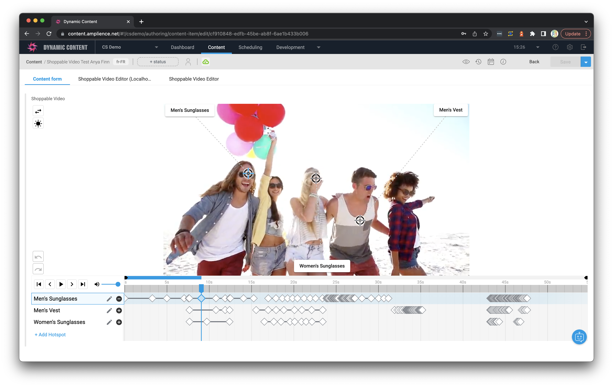
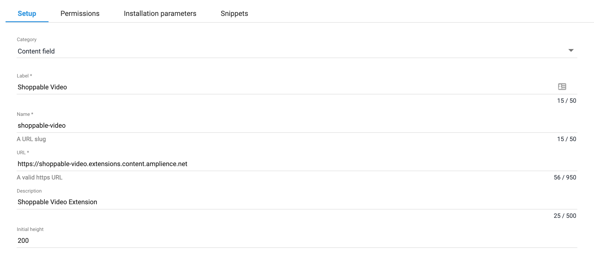
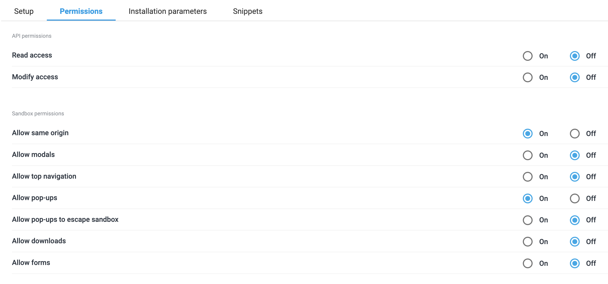

[](https://amplience.com/dynamic-content)



# Dynamic Content Shoppable Video Extension

This extension allows users to enrich a video with moving interactive hotspots, and associated call-to-action buttons that can be clicked as the video plays.

If you want to get started after cloning this repo, remember to sync packages with `npm i`.

## How to install

### Partial for Shoppabble Video Field and Configuration

The shoppable video extension has a rather complicated structure for the field it writes, so it's recommended that you put the schema in a partial. You can find the full partial definition in `shoppable-video-partial.json` in the base of this repository.

To use the schema when imported as a partial, use this snippet:

```json
{
    "shoppableVideo": {
        "title": "Shoppable Video",
        "description": "A video enriched with timed, animated hotspots that can be used for user interaction.",
        "allOf": [
            { "$ref": "https://amplience.com/shoppable-video-partial#/definitions/shoppableVideo" }
        ]
    }
}
```

### Register Extension

This extension needs to be [registered](https://amplience.com/docs/development/registeringextensions.html) against a Hub with in the Dynamic Content application (Developer -> Extensions), for it to load within that Hub.

#### Setup



* Category: Content Field
* Label: Shoppable Video _(this will appear as the tab title in the Dashboard)_
* Name: shoppable-video _(needs to be unique with the Hub)_
* URL: [https://shoppable-video.extensions.content.amplience.net](https://shoppable-video.extensions.content.amplience.net)
* Description: Shoppable Video Extension _(can be left blank, if you wish)_

Note:
You can use our deployed version of this extension (builds from the "production" branch) -

[https://shoppable-video.extensions.content.amplience.net](https://shoppable-video.extensions.content.amplience.net)

_As this is an open source project you're welcome to host your own "fork" of this project. You can use any standard static hosting service (Netlify, Amplify, Vercel, etc.) if you wish._

##### Permissions



Sandbox permissions:
- Allow same origin
- Allow pop-ups (required for link to help when an error occurs)

## Output Data Format & Usage

The shoppable video extension creates a simple format that you can ingest in your site to represent hotspots and CTAs however you want.

For information on the format structure, and how you might use it in your own renderer or video player, see [this documentation.](docs/FORMAT-USAGE.md)

## Visualization

The webapp for the extension can also double as a standalone visualization for the shoppable video field. It will run in visualization mode if you provide `?vse={{vse.domain}}` as a query sting parameter, and will read back the field from the `shoppableVideo` property of your content item. If you want to provide a different top level property, simply provide it in the query string like `fieldName=exampleVideo`.

The visualization uses the `dc-visualization-sdk` to update its preview as the field is being edited, so you'll be able to try hotspot interaction over your image as you add and move hotspots/keyframes.

To add the visualization to your content type, just switch to the `Visualizations` tab, and add a visualization with the extension as the url, and the query string `?vse={{vse.domain}}`.

## Development server

Install the Angular CLI globally, then run `ng serve --ssl` for a dev server. Navigate to `https://localhost:4200/`. The app will automatically reload if you change any of the source files.

If you want to test on DC, you'll need to link an extension to that same localhost url. Keep in mind that you might run into a browser security issue when using SSL, so if you're having any issues visit the extension directly and accept any ssl warnings.


## Angular CLI Information

This project was generated with [Angular CLI](https://github.com/angular/angular-cli) version 13.2.0.

### Development server

Run `ng serve --ssl` for a dev server. Navigate to `https://localhost:4200/`. The app will automatically reload if you change any of the source files.

### Code scaffolding

Run `ng generate component component-name` to generate a new component. You can also use `ng generate directive|pipe|service|class|guard|interface|enum|module`.

### Build

Run `ng build` to build the project. The build artifacts will be stored in the `dist/` directory.

### Further help

To get more help on the Angular CLI use `ng help` or go check out the [Angular CLI Overview and Command Reference](https://angular.io/cli) page.
